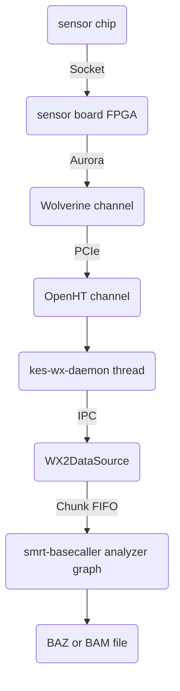
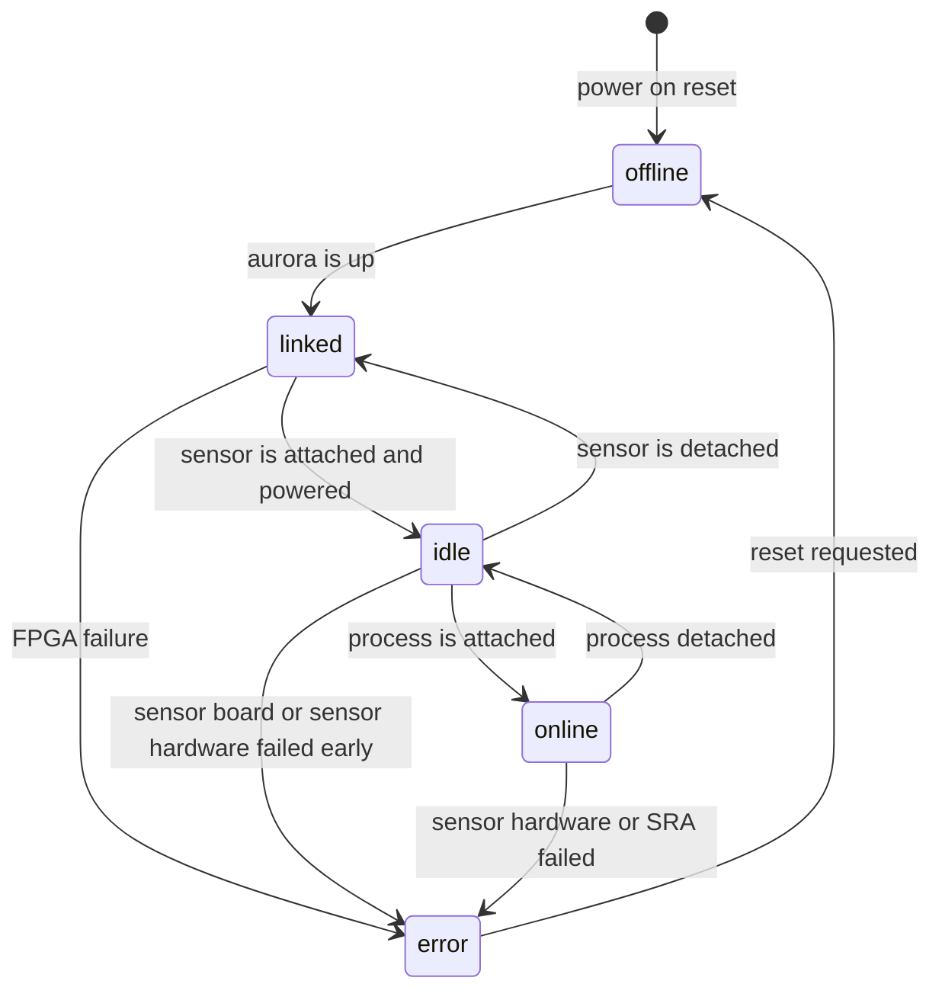
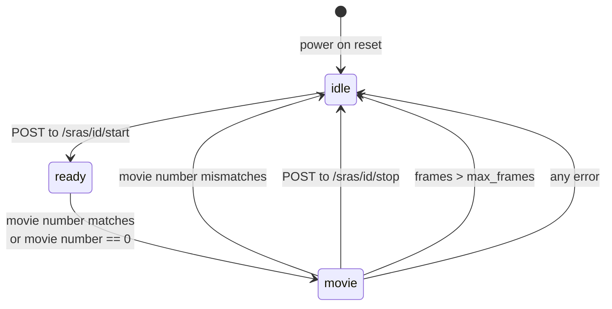

# Primary Analysis Webservice API

| Version | Date         | Author |
|---------|--------------|--------|
| 1.0     | June 4, 2021 |MLakata |
| 1.1     | Jan 28, 2022 |MLakata |


The Primary Analysis Webservice API is for controlling the ``pa-ws`` service. The service acts as a controller for all 
primary analysis applications, such as basecalling, calibration
and postprimary processing.

This API is intended to be called by 3 clients:

1. ICS - Instrument Control Software is the primary customer of pa-ws webservices.  It's model of pa-ws is of a process controller and disk storage manager.  ICS is responsible for driving primary analysis and maintaining the state of each "movie".

2. Chrome status dashboard - a self-referential dashboard written in Javascript that allows a live dashboard of pa-ws.

3. Test frameworks - For example, an end-to-end simulation. The test framework is essentially acting as an ICS emulator.


# Glossary

acquisition
: See "movie"

ICS
: Instrument Control Software.  The software that controls the entire instrument and is the controller of pa-ws.

movie
: A legacy term that is still a useful metaphor for describing
the "recording" of the live SMRT sequencing observations, but it has been extended to include the lifetime of processing the recording all the way to final basecalls.  Other synonyms for "movie" are "acquisition" and "subreadset" (which is the name used in the run design metadata XML).

pawnee
: An acroynym for "PAWs Nrt Execution Engine". This program runs all of the NRT postprimary applications. From the perspective of pa-ws, 
pawnee *is* postprimary, regardless of the postprimary workflow.

pa-ws
: The process that is the webservices interface to the world, including ICS, for all primary analysis functions.

postprimary
: A second process that analyzes basecalls and cuts the continuous stream of DNA bases into subreads, which map to the actual DNA template, by identifying and removing the artificial adapter sequences that were attached to the original DNA template.  In addition, the subreads can be further refined using CCS (aka HiFi) to reduce errors. These two processes run in a Linux pipe, such that together it virtually appears to be a single process, and this combined processing stage is called "postprimary". In late 2021, additional workflows were added (at least a dozen) and all of the workflows are now controlled by a new project named "pawnee".

sensor
: A collective term for both the physical CMOS sensor that is mounted to a stage as well as the PCB known as the "sensor board" that connects the CMOS sensor to the Aurora data link, through an FPGA.  Because the name is vague in general, it should not be used without additional wording, such as "sensor chip" (the consumable item) vs "sensor board" (the PCB with the FPGAs) vs "sensor stage" (the mounting platform for the sensor chip) or "sensor socket" (the electrical connector to the sensor chip). The "sensors" are numbered starting at 1.

socket
: A place where the sensor chip is mounted. The sockets are fixed in position inside the instrument.  The sensor boards attached to the sockets and each sensor board is giving a unique "socket number" and this number is used to identify where the sensor chips are placed.

SRA
: acronym for Sensor Resource Allocation. A logical grouping of hardware and software resources.  See section below for details. For the purpose of the API, an SRA is identified by the ``socket``.  As this is a heavily used software concept and used in arrays and vectors, SRAs are indexed at 0. Ideally, the pa-ws API does not expose SRA indices.

storage
: All files used to process an SRA are placed in a virtualized "storage" unit, which acts as a dedicated hard drive. An SRA typically will be placed in a single "storage" unit, although this is not a requirement.


# Conventions

## Payloads

Data payloads shall be JSON formatted text by default. Other
media formats are supported in cases where the payload is large
and a binary format offers a significant advantage or for
retrieving a single JSON field as just plain text.

A binary format would be justified for transmitting a full chip image of the dark frame for example.

The http payloads are controlled via the ``accepted`` and ``context-type`` HTTP header fields. The following 
media types will be accepted as input and output:

| Media name                   | Shortcut  | Use         | Reference |
|------------------------------|-----------|-------------|--------------------- |
| ``application/json``         | ``.json`` | General              | <https://en.wikipedia.org/wiki/JSON> |
| ``text/plain``               | ``.txt``  | Single data field    | n/a |
| ``image/png``                | ``.png``  | 2D chip image, lossless compression       | <https://en.wikipedia.org/wiki/Portable_Network_Graphics> |
| ``image/x-portable-graymap`` | ``.pgm``  | 2D chip image, trivial uncompressed, P2 and P3 formats | <http://netpbm.sourceforge.net/doc/pgm.html> |

As a convenience, URLs can also be constructed with the shortcut
extension to chose the accepted return type.  This is useful for
manually typing in a URL to a webbrowser to return a particular
image type (for example ``.png``), or when returning a
particular data field without JSON quoting (for example
``.txt``).

For example, to request that the response be in PNG format, the http header must contain

    accepted: image/png

For example, to install a dark frame using a PGM file, the http 
content would have a header and body that looks something like this:

    content-type: image/x-portable-graymap

    P2
    # dark frame 8-bit image that is full Sequel chip
    2048 1144
    255
    0  0  1  0  3  2  0  0  0  1  0  0  0  9  9  7  0  0  0  0  0  0  0  1
    0  3  3  3  3  1  0  7  7  7  7  0  0 11 11 11 11  0  0 15 15 15 15  0
    0  3  0  0  0  5  5  7  0  0  0  0  0 11  0  0  0  0  0 15  0  0 15  0
    0  3  3  3  0  0  0  7  7  7  0  0  0 11 11 11  0  0  0 15 15 15 15  0
    .. followed by approximately another million pixel values

Note that P3 (binary PGM) would be preferred over P2.


## Naming

All field names shall use lower case.

All fields shall use "camelCase" for multiword names, which
concatenates the names with following words capitalized in the first lett.  For example,
``currentFrameIndex``. If this document contains non-camelCase words (for example
snake_case), then this document is incorrect and should be fixed. This document is 
manually managed and I manually changed the naming convention after an early draft.

## Endpoint paths

For endpoints that return a hierarchical JSON object, the path
into the JSON object can be appended to the URL. For example to
return just the statistics subobject of a particular SRA, the
following URL is appropriate:

    > curl {{url_base}}/sockets/1/basecaller/processStatus
    {
        "completionStatus" : "UNKNOWN",
        "executionStatus" : "RUNNING",
        "exitCode" : 0,
        "timestamp" : "20220128T01:03:05.000Z"
    }
    >

Using a media type of ``text/plain`` or using the ``.txt`` shortcut is not defined for hierarchical JSON objects.
Something will be returned, but it will only suitable for humans and the format may change.

For single values, just the JSON value will be returned. This
can be cumbersome with JSON strings that are quoted.  If this is
not desired, a shortcut can be used to change the return type to
``text/plain`` by adding ``.txt`` to the end of the URL. For
example, the state of the SRA can be returned in one of the
following ways:

    curl {{url_base}}/sockets/1/basecaller/processStatus/executionStatus
    "RUNNING"
    curl {{url_base}}/sockets/1/basecaller/processStatus/executionStatus.json
    "RUNNING"
    curl {{url_base}}/sockets/1/basecaller/processStatus/executionStatus.txt
    RUNNING

Of course, using a ``.png`` shortcut for a text field is not allowed and will return a 400 Bad Request.

##  File URLs

All filenames shall be specified using proper URL syntax.  For the immediate design, the following URLs shall be supported.

 * ``file:/path0/path1/path2`` or ``file://host/path0/path1/path2``
   These get translated to ``/path0/part1/path2`` etc on the command lines. For the purpose of pa-ws, `host` can be either `rt` or `icc`. Because data files on the nrt are managed by pa-ws,
   URLS of the form file://nrt0/etc/etc are discouraged.

 * http://pawshost/storages/m123456/files/file0

   This gets translated to a local file by concantenating the value of ``/storages/m123456/linuxPath`` with ``filename``. For example, if the m123456 storage object is on ``/data/pa/tmp.fab73c90``, then the URL is translated to ``/data/pa/tmp.fab73c90/file0``.

 * http://pawshost/storages/m123456/files/path0/filename

   This gets translated to a local file by concantenating the value of ``/storages/m123456/linuxPath`` with ``filename``. For example, if the m123456 storage object is on ``/data/pa/tmp.fab73c90``, then the URL is translated to ``/data/pa/tmp.fab73c90/path0/file0``.
 
If the protocol is left off, then the protocol is assumed to be `file:`. 

### All API calls start with

<pre class="base">
{{url_base}}
</pre>

Port is 23632.  Example ``{{url_base}}`` is ``http://rt-98765:23632``.

### Return status

#### 200 OK

Successful response

#### 400 Bad Request

Bad top level end points will result in BAD_REQUEST if the top level path element is not supported.

#### 403 Forbidden

Illegal state transitions will result in FORBIDDEN

#### 404 Not Found

Endpoint not found. This can happen both for top level end point paths not existing, as well as index 
values being out of range.

#### 500 Internal Server Error

There was a problem processing the request due to a problem internal to the server and not due to 
the actual underlying applications. For example, if the webservices run out of memory or
an exception is unhandled.

#### 501 Not Implemented

Only returned when a service has been documented but not implemented.

#### 503 Service Unavailable

This is a temporary situation. The client should try again multiple times with variable wait periods until
the response does not return 503.

#### 507 Insuffient space

This is returned if there is insufficent space to create a new /storages endpoint

# SRA Sensor Resource Allocation

The SRA is a logic grouping of the following components shown in this flow chart.
Each sensor board is assigned to one SRA.



# Software Model 

Each SRA is a state machine.  Immediately after construction,
each SRA is in the "offline" state.  The SRA has not connected
to a sensor board yet and is waiting for a connection. Once
handshaking between the Wolverine and the sensor board FPGA is
complete via Aurora, the state will progress to "linked".

When a SRA ready and has connected to a sensor through the
sensor board and notified via the Aurora link, it will
transition to the "idle" state automatically. While in the idle
state, it may receive metadata, such as frame headers which are
monitored through the REST API, but otherwise all data is
ignored and discarded.  
The sensor board number will be available in the REST API in
this state.

When a client datasource connects to the SRA, it transitions to the "online" state.  The online state simply means that an SRA
is locked to a particular process. Actual data collection is not part of the state machine.

If there is a fatal problem with the SRA, the state will become
"error".  There is no way of recovering additional data from the
"error" state without a channel-wise restart.  Errors which can
result in the "error" state are

* aurora loss or sensor board power loss or sensor malfunction while in the "online" state,

* unrecoverable software exception (caught at the top of the thread call stack)

In the error state, the REST API is available for read, but the
only active command accepted is a *reset* that will do the
equivalent of a hard reset of the personality channel associated
with that SRA.

SRA state machine:



Not shown in diagram are reset requests from other states
besides "error".  
This type of reset is not anticipated, but it is allowed.  A
reset should only been done from the error state.

Data flow state machine. The data flow only occurs while the SRA state is "online". The state
transitions only on the movie number matching or not, or on explicit ``/start`` or ``/stop`` end point POSTS.




## Sequence Diagrams


### Normal Data Collection

ICS wishes to collect data from Socket N.


```mermaid
sequenceDiagram
    autonumber
    participant A as sensor
    participant B as pa-ws
    participant C as ICS

    C->>B: POST /storage/m123456
    B->>C: /storage/m123456

    C->>B: POST /sockets/0/darkcal/start
    B->>C: /sockets/0/darkcal

    C->>B: GET /sockets/0/darkcal/processStatus/executionStatus
    B->>C: RUNNING

    C->>A: sensor passthrough<br/>movie number=111

    loop Confirm "SUCCESS"
      C->>+B: GET {{url_base}}/sockets/0/darkcal/processStatus/completionStatus
      B-->>-C: OK "SUCCESS"
    end  


    C->>B: POST /sockets/0/basecaller/start
    B->>C: /sockets/0/basecaller

    C->>B: GET /sockets/0/basecaller/processStatus/executionStatus
    B->>C: RUNNING

    C->>A: sensor passthrough<br/>movie number=113

    loop Confirm "SUCCESS"
      C->>+B: GET {{url_base}}/sockets/0/basecaller/processStatus/completionStatus
      B-->>-C: OK "SUCCESS"
    end  

    C->>B: POST /postprimary/m123456
    B->>C: /postprimary/m123456

    loop Confirm "SUCCESS"
      C->>+B: GET {{url_base}}/postprimary/m123456/processStatus/completionStatus
      B-->>-C: OK "SUCCESS"
    end  
 
    C->> B: DELETE /postprimary/m123456
    C->> B: DELETE /sockets/0
    C->> B: DELETE /storage/m123456

    C : transfers all files off instrument
```


# General

## GET /status

Returns a JSON of overall health, including the current UTC time and uptime. These can be queried to determine if pa-ws is alive.


## GET /dashboard

Return interactive Javascript activated dashboard that displays kes-wx-daemon overall status, and individual connection statistics.
will query the other end points (/sensors, /status)

## GET /doc

Returns the document you are currently reading.  The markdown file is rendered into pretty HTML and 
contained within the pa-ws binary.

## GET /api

Returns this API documention for the REST interface. It is rendered using Swagger, which gives a dynamic browsable view of the API,
and each endpoint can be tested interactively from this page.

## GET /log

TODO: specify range of log, perhaps --since notation used in Linux. (--since today, --since 0:00).
Log entries will be JSON objects (message, timestamp, severity).

TODO: decide if SRA will be a field or not, or if the /sras will have its own log endpoint.

## POST /shutdown

Shuts down the webserver gently.  The exit code will be 0, which means that systemd will not
restart the process.

# JSON objects

```json
"processStatus": {
    "executionStatus": "UNKNOWN" or "RUNNING" or "COMPLETE",
    "completionStatus": "UNKNOWN" or "SUCCESS" or "FAILED" or
                        "ABORTED",
    "timestamp" : "<ISO8601 format, Zulu timezone>"
    "exitCode" : 0
}
```

``completeStatus`` is only valid when ``executionStatus=COMPLETE``.

``exitCode`` will be 0 on success, 1 to 127 on non-signaled error exit, and 128 to 144 on signaled exit.  For example, segmentation fault is a signaled exit of 137 (128 + 11).

# sockets

For Primary, there are to be 4 sockets, although the architecture doesn't limit this number in any way.

Sockets are indexed from 1.  Note that there is a 1:1 correspondence between Sockets and SRAs, but the mapping is determined at run time, as sockets
may be plugged into any SRA.

GET returns a sorted JSON array of the socket indices. Normally, this will return `[1,2,3,4]` for Kestrel, unless sockets are not present.

The GET end point will return the values previously POSTed, in addition to a "status" object.

## sockets/N/basecaller

Optional key:value pairs on POST. This list is not exhaustive, but highlights the more important fields.

crosstalkFilter
: Usually this is omitted, and the crosstalk_filter is calculated from the pixel_spread_function. But if the crosstalk_filter is specified, the pixel_spread_function is ignored.

movieMaxFrames and movieMaxSeconds
: if only one is specified, the other value will be extrapolated using the expected_frame_rate and a small margin.

sequencingRoi
: Can be omitted and the entire chip will be used

traceFileRoi and traceFileUrl
: Can both be omitted and no trace file will be written. If the trace file is to be written, they *both* must be specified.

## sockets/N/darkcal

The end point for controlling kes-cal to obtain dark calibration files. The only required fields are
the movieMaxFrames and the destination URL.  Note that the interface is very similar to `loadingcal`. 

## sockets/N/loadingcal

The end point for controlling kes-cal to obtain dynamic loading calibration files.  The only required fields are
the movieMaxFrames, the destination URL and the darkcal file URL.  Note that the interface is very similar to `darkcal`, but the
only difference is that this requires a darkcal file URL.


# Release Notes

1.0:
* original spec

1.1:
* complete review of everything. the /transfer endpoints were removed.

    

