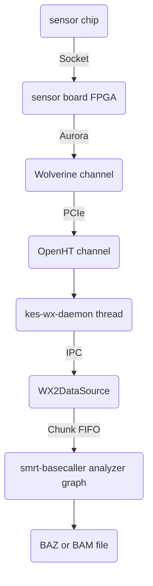
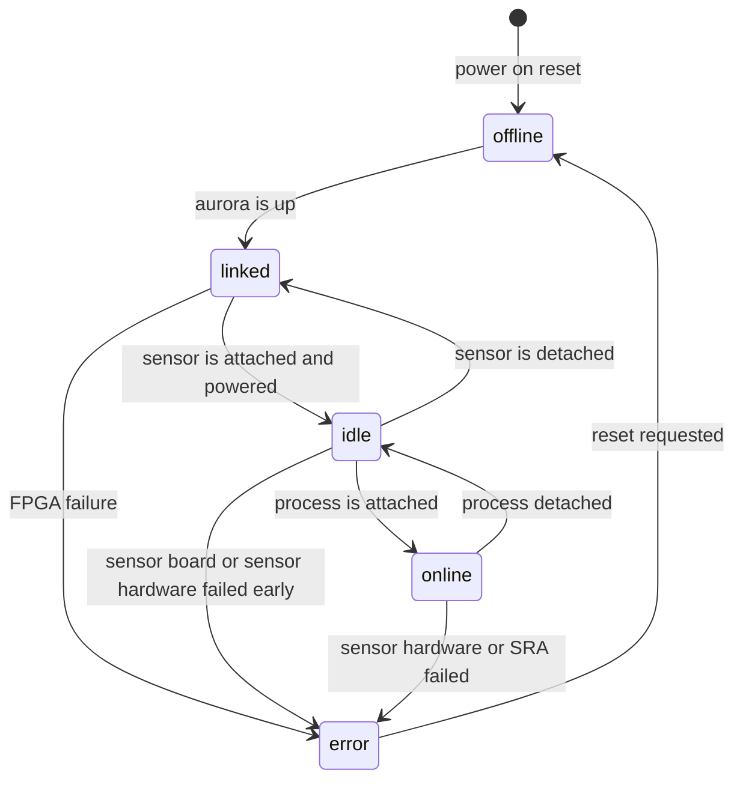
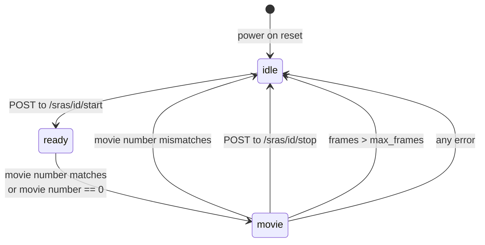
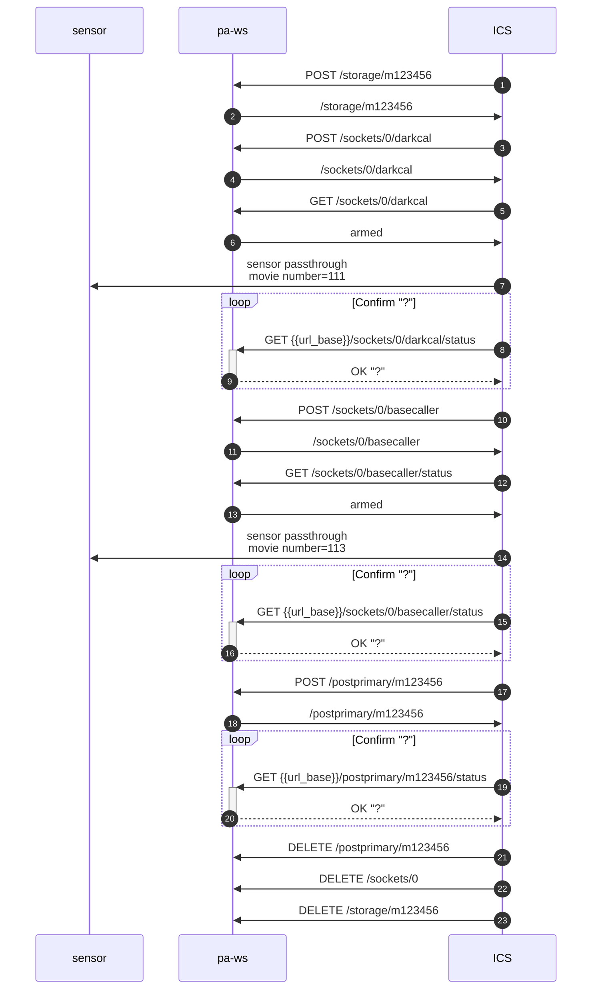
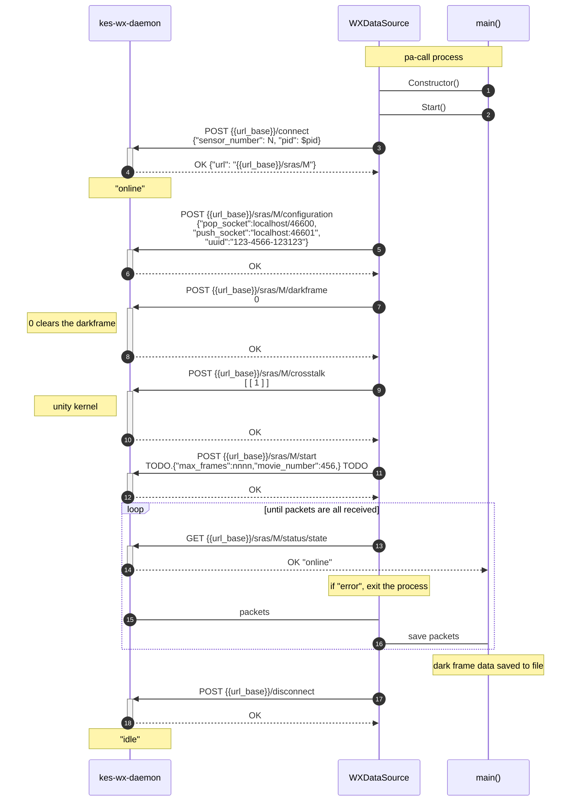
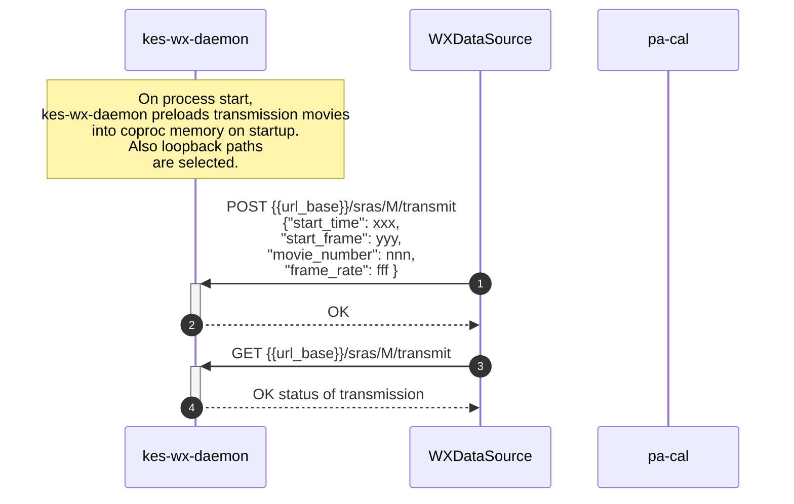

# Primary Analysis Webservice API

| Version | Date         | Author |
|---------|--------------|--------|
| 1.0     | June 4, 2021 |MLakata |


The Primary Analysis Webservice API is for controlling the ``pa-ws`` service. The service acts as a controller for all 
primary analysis applications, such as basecalling, calibration
and postprimary processing.

This API is intended to be called by 3 clients:

1. ICS - Instrument Control Software is the primary customer of pa-ws webservices.  It's model of pa-ws is of a process controller and disk storage manager.  ICS is responsible for driving primary analysis and maintaining the state of each "movie".

2. Chrome status dashboard - a self-referential dashboard written in Javascript that allows a live dashboard of pa-ws.

3. Test frameworks - For example, an end-to-end simulation. The test framework is essentially acting as an ICS emulator.


# Glossary

acquisition
: See "movie"

ICS
: Instrument Control Software.  The software that controls the entire instrument and is the controller of pa-ws.

movie
: A legacy term that is still a useful metaphor for describing
the "recording" of the live SMRT sequencing observations, but it has been extended to include the lifetime of processing the recording all the way to final basecalls.  Other synonyms for "movie" are "acquisition" and "subreadset" (which is the name used in the run design metadata XML).

pawnee
: An acroynym for "PAWs Nrt Execution Engine". This program runs all of the NRT postprimary applications. From the perspective of pa-ws, 
pawnee *is* postprimary, regardless of the postprimary workflow.

pa-ws
: The process that is the webservices interface to the world, including ICS, for all primary analysis functions.

postprimary
: A second process that analyzes basecalls and cuts the continuous stream of DNA bases into subreads, which map to the actual DNA template, by identifying and removing the artificial adapter sequences that were attached to the original DNA template.  In addition, the subreads can be further refined using CCS (aka HiFi) to reduce errors. These two processes run in a Linux pipe, such that together it virtually appears to be a single process, and this combined processing stage is called "postprimary". In late 2021, additional workflows were added (at least a dozen) and all of the workflows are now controlled by a new project named "pawnee".

sensor
: A collective term for both the physical CMOS sensor that is mounted to a stage as well as the PCB known as the "sensor board" that connects the CMOS sensor to the Aurora data link, through an FPGA.  Because the name is vague in general, it should not be used without additional wording, such as "sensor chip" (the consumable item) vs "sensor board" (the PCB with the FPGAs) vs "sensor stage" (the mounting platform for the sensor chip) or "sensor socket" (the electrical connector to the sensor chip). The "sensors" are numbered starting at 1.

socket
: A place where the sensor chip is mounted. The sockets are fixed in position inside the instrument.  The sensor boards attached to the sockets and each sensor board is giving a unique "socket number" and this number is used to identify where the sensor chips are placed.

SRA
: acronym for Sensor Resource Allocation. A logical grouping of hardware and software resources.  See section below for details. For the purpose of the API, an SRA is identified by the ``socket``.  As this is a heavily used software concept and used in arrays and vectors, SRAs are indexed at 0. Ideally, the pa-ws API does not expose SRA indices.

storage
: All files used to process an SRA are placed in a virtualized "storage" unit, which acts as a dedicated hard drive. An SRA typically will be placed in a single "storage" unit, although this is not a requirement.


# Conventions

## Payloads

Data payloads shall be JSON formatted text by default. Other
media formats are supported in cases where the payload is large
and a binary format offers a significant advantage or for
retrieving a single JSON field as just plain text.

A binary format would be justified for transmitting a full chip image of the dark frame for example.

The http payloads are controlled via the ``accepted`` and ``context-type`` HTTP header fields. The following 
media types will be accepted as input and output:

| Media name                   | Shortcut  | Use         | Reference |
|------------------------------|-----------|-------------|--------------------- |
| ``application/json``         | ``.json`` | General              | <https://en.wikipedia.org/wiki/JSON> |
| ``text/plain``               | ``.txt``  | Single data field    | n/a |
| ``image/png``                | ``.png``  | 2D chip image, lossless compression       | <https://en.wikipedia.org/wiki/Portable_Network_Graphics> |
| ``image/x-portable-graymap`` | ``.pgm``  | 2D chip image, trivial uncompressed, P2 and P3 formats | <http://netpbm.sourceforge.net/doc/pgm.html> |

As a convenience, URLs can also be constructed with the shortcut
extension to chose the accepted return type.  This is useful for
manually typing in a URL to a webbrowser to return a particular
image type (for example ``.png``), or when returning a
particular data field without JSON quoting (for example
``.txt``).

For example, to request that the response be in PNG format, the http header must contain

    accepted: image/png

For example, to install a dark frame using a PGM file, the http 
content would have a header and body that looks something like this:

    content-type: image/x-portable-graymap

    P2
    # dark frame 8-bit image that is full Sequel chip
    2048 1144
    255
    0  0  1  0  3  2  0  0  0  1  0  0  0  9  9  7  0  0  0  0  0  0  0  1
    0  3  3  3  3  1  0  7  7  7  7  0  0 11 11 11 11  0  0 15 15 15 15  0
    0  3  0  0  0  5  5  7  0  0  0  0  0 11  0  0  0  0  0 15  0  0 15  0
    0  3  3  3  0  0  0  7  7  7  0  0  0 11 11 11  0  0  0 15 15 15 15  0
    .. followed by approximately another million pixel values

Note that P3 (binary PGM) would be preferred over P2.


## Naming

All field names shall use lower case.

All fields shall use "camelCase" for multiword names, which
concatenates the names with following words capitalized in the first lett.  For example,
``currentFrameIndex``. If this document contains non-camelCase words (for example
snake_case), then this document is incorrect and should be fixed. This document is 
manually managed and I manually changed the naming convention after an early draft.

## Endpoint paths

For endpoints that return a hierarchical JSON object, the path
into the JSON object can be appended to the URL. For example to
return just the statistics subobject of a particular SRA, the
following URL is appropriate:

    > curl {{url_base}}/sockets/1/basecaller
    {
        "status": RUNNING,
        "rt_metrics": 
        {
            "timestamp": "20210603T 13:45:65.012Z",
            "url": "http://foo/bar"
        }
    }
    >

Using a media type of ``text/plain`` or using the ``.txt`` shortcut is not defined for hierarchical JSON objects.
Something will be returned, but it will only suitable for humans and the format may change.

For single values, just the JSON value will be returned. This
can be cumbersome with JSON strings that are quoted.  If this is
not desired, a shortcut can be used to change the return type to
``text/plain`` by adding ``.txt`` to the end of the URL. For
example, the state of the SRA can be returned in one of the
following ways:

    curl {{url_base}}/sockets/1/basecaller/status
    "RUNNING"
    curl {{url_base}}/sockets/1/basecaller/status.json
    "RUNNING"
    curl {{url_base}}/sockets/1/basecaller/status.txt
    RUNNING

Of course, using a ``.png`` shortcut for a text field is not allowed and will return a 400 Bad Request.

##  File URLs

All filenames shall be specified using proper URL syntax.  For the immediate design, the following URLs shall be supported.

 * ``file:/path0/path1/path2`` or ``file://host/path0/path1/path2``
   These get translated to ``/path0/part1/path2`` etc on the command lines.

 * http://pawshost/storages/m123456/files/file0

   This gets translated to a local file by concantenating the value of ``/storages/m123456/linuxPath`` with ``filename``. For example, if the m123456 storage object is on ``/data/pa/tmp.fab73c90``, then the URL is translated to ``/data/pa/tmp.fab73c90/file0``.

 * http://pawshost/storages/m123456/files/path0/filename

   This gets translated to a local file by concantenating the value of ``/storages/m123456/linuxPath`` with ``filename``. For example, if the m123456 storage object is on ``/data/pa/tmp.fab73c90``, then the URL is translated to ``/data/pa/tmp.fab73c90/path0/file0``.
 
If the protocol is left off, then the protocol is assumed to be `file:`. 

### All API calls start with

<pre class="base">
{{url_base}}
</pre>

Port is 23632.  Example ``{{url_base}}`` is ``http://rt-98765:23632``.

### Return status

#### 200 OK

Successful response

#### 400 Bad Request

Bad top level end points will result in BAD_REQUEST if the top level path element is not supported.

#### 403 Forbidden

Illegal state transitions will result in FORBIDDEN

#### 404 Not Found

Endpoint not found. This can happen both for top level end point paths not existing, as well as index 
values being out of range.

#### 500 Internal Server Error

There was a problem processing the request due to a problem internal to the server and not due to 
the actual underlying applications. For example, if the webservices run out of memory or
an exception is unhandled.

#### 501 Not Implemented

Only returned when a service has been documented but not implemented.

#### 503 Service Unavailable

This is a temporary situation. The client should try again multiple times with variable wait periods until
the response does not return 503.

# SRA Sensor Resource Allocation

The SRA is a logic grouping of the following components shown in this flow chart.
Each sensor board is assigned to one SRA.



# Software Model 

Each SRA is a state machine.  Immediately after construction,
each SRA is in the "offline" state.  The SRA has not connected
to a sensor board yet and is waiting for a connection. Once
handshaking between the Wolverine and the sensor board FPGA is
complete via Aurora, the state will progress to "linked".

When a SRA ready and has connected to a sensor through the
sensor board and notified via the Aurora link, it will
transition to the "idle" state automatically. While in the idle
state, it may receive metadata, such as frame headers which are
monitored through the REST API, but otherwise all data is
ignored and discarded.  
The sensor board number will be available in the REST API in
this state.

When a client datasource connects to the SRA, it transitions to the "online" state.  The online state simply means that an SRA
is locked to a particular process. Actual data collection is not part of the state machine.

If there is a fatal problem with the SRA, the state will become
"error".  There is no way of recovering additional data from the
"error" state without a channel-wise restart.  Errors which can
result in the "error" state are

* aurora loss or sensor board power loss or sensor malfunction while in the "online" state,

* unrecoverable software exception (caught at the top of the thread call stack)

In the error state, the REST API is available for read, but the
only active command accepted is a *reset* that will do the
equivalent of a hard reset of the personality channel associated
with that SRA.

SRA state machine:



Not shown in diagram are reset requests from other states
besides "error".  
This type of reset is not anticipated, but it is allowed.  A
reset should only been done from the error state.

Data flow state machine. The data flow only occurs while the SRA state is "online". The state
transitions only on the movie number matching or not, or on explicit ``/start`` or ``/stop`` end point POSTS.




## Sequence Diagrams


### Normal Data Collection

ICS wishes to collect data from Socket N.




### Darkframe or loading calibration collection

The dark frame movie is no different from real data collection; A ``movie_number`` is used just like normal data collection, and ICS must use this correctly.

For the dark frame calibration, the personality dark frame is set to 0 and the crosstalk kernel is set to a unity (passthrough) kernel before data collection.

This example shows dark frame calibration, but the same sequence diagram could be used for other calibration collections.




### Simulated Transmission





# General

## GET /status

Returns a JSON of overall health

    {
        "uptime": seconds since process launch (double precision seconds since Epoch),
        "cpuLoad" : CPU load as floating point number, normalized to one core (1.0),
        "version": "daemon software version",
        "personality":
        {
            "version": semantic version (#.#.#) of personality as string,
            "buildTimestamp": ISO 8091 of the build time, e.g. "2021-02-11 14:01:00Z",
            "comment": optional comment about personality for R&D purposes,
            "wxinfo": {
                all fields of the output of `wxinfo -d`
            }
        },
        "numSras": number N of SRAs available, indexed from 0 to N-1
    }


## GET /dashboard

Return interactive Javascript activated dashboard that displays kes-wx-daemon overall status, and individual connection statistics.
will query the other end points (/sensors, /status)

## GET /api

Returns this API documention for the REST interface. At minimum a static HTML document.

## GET /log

TODO: specify range of log, perhaps --since notation used in Linux. (--since today, --since 0:00).
Log entries will be JSON objects (message, timestamp, severity).

TODO: decide if SRA will be a field or not, or if the /sras will have its own log endpoint.

## POST /shutdown

      Shuts down the webserver.  The exit code will be 0, which means that systemd will not
      restart the process.

      data: ""

      response: ""

# JSON objects

```json
"processStatus": {
    "executionStatus": "UNKNOWN" or "RUNNING" or "COMPLETE",
    "completionStatus": "UNKNOWN" or "SUCCESS" or "FAILED" or
                        "ABORTED",
    "timestamp" : "<ISO8601 format, Zulu timezone>"
    "exitCode" : 0
}
```

``completeStatus`` is only valid when ``executionStatus=COMPLETE``.

``exitCode`` will be 0 on success, 1 to 127 on non-signaled error exit, and 128 to 144 on signaled exit.  For example, segmentation fault is a signaled exit of 137 (128 + 11).

# Sockets

For Primary, there are to be 4 sockets, although the architecture doesn't limit this number in any way.

:id is index of SRA, counts from 1 to 4. 

The GET end point will return the values previously POSTed, in addition to a "status" object.

## Sockets/N/basecaller

Optional key:value pairs on POST. This list is not exhaustive, but highlights the more important fields.

crosstalkFilter
: Usually this is omitted, and the crosstalk_filter is calculated from the pixel_spread_function. But if the crosstalk_filter is specified, the pixel_spread_function is ignored.

logLevel
: defaults to INFO

logUrl
: if omitted, no log file will be saved

movieMaxFrames and movieMaxSeconds
: if only one is specified, the other value will be extrapolated using the expected_frame_rate and a small margin.

sequencingRoi
: Can be omitted and the entire chip will be used

traceFileRoi and traceFileUrl
: Can both be omitted and no trace file will be written. If the trace file is to be written, they *both* must be specified.

## Sockets/N/darkcal

Optional key:value pairs on POST:

logLevel
: defaults to INFO

movieMaxFrames and movieMaxSeconds
: if only one is specified, the other value will be extrapolated using the expected_frame_rate and a small margin.

logUrl
: if omitted, no log file will be saved

The object mode for an SRA is

```json
{
    "sraIndex": 0 to 3,
    "sensorNumber": 1 to 4,
    "status":
    {
        "sensor":
        {
            "rows": number of rows on connected sensor,
            "cols": number of columns on connected sensor,
            "exposure": exposure time of each frame in seconds (floating point),
            "cellId": cell name or ID
            "chiplayout": name of the chiplayout,
            TBD other fields that the sensor can transmit via PDU messenging such as chip serial number
        },
        "state" : "offline" |     # SRA constructed but sensor not connected
                "linked" |        # aurora is linked
                "idle" |          # sensor is present
                "online" |        # application is connected
                "error",          # SRA is not usable without reset
        "statistics": {
            "frames": number of frames received since sensor enabled,
            "pdu_overflows": number of PDU overflows,
            TBD other statistics
        },
        "live":
        {
            "aurora": "up" or "down",  # Aurora connection
            "currentFrameIndex" : uint64 of the current frame header,
            "frameRate" : frame rate per second as double precision (as measured by frame header received time),
            "frameRateSensor" : frame rate per second as double precision (as measured by deltas of the frame header time stamp),
            "threadDutyCycle" : measurement of the thread duty cycle. A value of 1.0 is fully loaded,
            "movieNumber": the most recent movie_number seen in the stream. should match configuration.movie_number to take data, or 0 by default
            "memoryPool": pool number of the last pointer handled. All pointers should be in the same pool,
            "movieState": "idle" | "ready" | "movie"
        },
        "transmitter" : {
            "frameIndex": uint64 of the frame that was last transmitted,
            "frameOffset": uint64 offset into the simulated file or pattern,
            "numFrames": total number of frames in the simulated file or pattern,
            "state" : state of the movie transmitter
            {
                "idle",
                "preloading",
                "transmitting"
            }
        },
    },
    "configuration" :
    {
        "movieNumber": movie_number   # the desired movie number
        "roi" : 
        [
            [ rowMin, colMin, numRows, numCols ]   rectangles of sequencing ROI
        ]
        "popSocket": string that names the pop socket (incoming IPC messages),
        "pushSocket": string that names the push socket (outgoing IPC messages),
        "uuid": uuid of acquisition aka subread set from XML. Not used programmatically,
        "dataPath":
            "normal" |  no loopback. Receiver connected to sensor, transmitter goes off coprocessor.
            "hardloop" | transmitter and received Aurora ports are connected together
            "softloop" | transmitter and receiver data is connected through FPGA fabric
        }
    },
    "sensorFpgaRegisters":   contains the last cached values of the registers. When the registers are updated is TBD.
    [
        { 
            "number": register number,
            "value": register value,
            "name": optional human readable register name
        },
        {
            "number": ...
        },
        ...
    ],
}
```

When an SRA is queries, the entire SRA object will be returned. To obtain smaller pieces of data, only subtrees
of the hierarchy can be requested.


## GET /sras

GET returns a sorted JSON array of all available SRAs.

## GET /sras/:id

$uuid is index of SRA, counts from 0 to 3. 
GET returns status of the SRA. Things like aurora status, bytes received, PDUs received, etc

#### example request

    $ curl {{url_base}}/sras/3

#### example response

    {
        "sra_index" : 3,
        "sensor_number" : 4,
        "status" : 
        { 
            "state": "online",
            "frame_rate" : 100.1,
            "statistics": 
            {
                "frame": 148635356,
                "pdu_overflows": 0
            },
            "thread_duty_cycle" : 0.85423,
                    "sensor":
            "sensor" : {
              "rows" : 1144,
              "cols" : 2048
            },
            "live":
            {
                "aurora": "up",
                "current_frame_index" : 1000000,
                "frame_rate" : 100.01,
                "frame_rate_sensor" : 100.00,
                "thread_duty_cycle" : 0.76231,
                "movie_number": 100,
                "memory_pool": 2
            },
            "transmitter" : 
            {
                "source": "",
                "frame_index": 0,
                "frame_offset": 0,
                "num_frames": 0,
                "frame_rate": 0.0,
                "state" : "idle"
            }
        },
        "configuration" :
        {
            "movie_number": 100,
            "rows" : 1144,
            "cols" : 2048,
            "pop_socket" : "localhost:46661",
            "push_socket" : "localhost:46660",
            "uuid" : "22639f9e-2bad-4cf0-b6bf-43380e318cc2"
        },
        "sensor_fpga_registers":
        [ # these are all fictious registers
            {"number":0,"value":6,"name":"vroi"},
            {"number":1,"value":234,"name":"scanclock"},
            {"number":2,"value":1,"name":"passthrough"}
        ]
    }


## POST /sras/:id/configuration

Write several configuration settings at once using a single JSON object.

    $ curl -X POST -d '{"push_socket":"localhost":46600,"pull_socket":"localhost:46601"}' {{url_base}}/sras/3/configuration

## POST /sras/:id/configuration/:field

Write a single configuration setting using a JSON value.

Accepted :field choices:

``movie_number``:
    The desired movie number that will begin the capture mechanism.
               If this number is set to 0, then the capture will begin immediately
               and continue until the ``stop`` endpoint is posted. Otherwise, capture will end when the 
               movie number from the sensor FPGA changes to a value different than this value.

``rows``:
    The number of rows that the sensor should emit. *DEPRECATED for Primary* This number should be automatically 
    negotiated between the sensor board and the WX2.  For a Spider personality, this number is still needed.

``cols``:
    The number of columns that the sensor should emit. *DEPRECATED for Primary* This number should be automatically 
    negotiated between the sensor board and the WX2. For a Spider personality, this number is still needed.

``push_socket``:
    The socket that the kes-wx-daemon will push IPC messages to indicating completed packets

``pull_socket``:
    The socket that the kes-wx-daemon will pull IPC messages from indicating empty packets

``uuid``:
    An arbitrary UUID that can be used for debugging visibility.

``roi``:
    JSON array of ``[[rowMin,colMin,numRows,numCols]]`` that selects the sequencing region of interest.  Lanes
    that entirely lie outside of this rectangle will not produce any Packets.  The default is to collect
    the entire chip's region.

#### Example POST requests

    $ curl -X POST -d '"localhost:46600"' {{url_base}}/sras/3/ipc/configuration/push_socket
    $ curl -X POST -d \"localhost:46601\" {{url_base}}/sras/3/ipc/configuration/pull_socket
    $ curl -X POST -d 3141592 {{url_base}}/sras/3/ipc/configuration/movie_number

Note that shell-escaped double quotes are required around JSON strings for the POST, and are returned with the GET. Double quotes are not required
for JSON numerical values.

#### Example follow up queries

    $ curl {{url_base}}/sras/3/ipc/configuration/push_socket
    "localhost:46600"
    $ curl {{url_base}}/sras/3/ipc/configuration/pull_socket.txt
    localhost:46601
    $ curl {{url_base}}/sras/3/ipc/configuration/movie_number
    3141592


## POST /sras/:id/start

Begin data flow for packets. This can only be used from the "online" state.
From any other state, this will result in a prohibited response state.
If the movie_number configuration is 0, then packets will be sent to the IPC push socket ASAP. If the movie_number is non zero, then
the FPGA will ignore incoming data if the inband movie number marker does not match the matching configuration/movie_number.
Packet flow will continue until one of the following:

1. the inband movie number marker changes
2. a POST is made to ``/sras/:id/stop``
3. the number of frames acquired after the start message exceeds the ``max_frames`` counter.


## POST /sras/:id/stop

End data flow for packets. Data will stop after all the partially filled packets for a chunk have been
flushed to the host. In any other state, this command has no affect.  

This end point is only to be used in exceptional circumstances. The movie number markers are to be used for
ending the movie. 


## GET /sras/:id/darkframe

Returns the current installed darkframe. The format of the response will depend on the request. Two formats will be supported: contect-type/json as JSON which will be 
arrays of arrays of pixel values, or content-type/image/fixme/pgm which will be a PGM image.

This is only available for certain states, like "idle"

#### Example request
 
    $curl -o darkframe.png {{url_base}}/sras/3/darkframe.png 

## POST /sras/:id/darkframe

POST the enclosed dark frame image will be installed into the coproc memory. Data will be formatted in base64 in the JSON for POST

This is only available for states "idle" and "online".

## GET /sras/:id/crosstalk

GET will return the current installed crosstalk kernel

This is only available for states "idle" and "online".

## POST /sras/:id/crosstalk

POST the enclosed cross talk kernel will be installed into the coproc memory. Data will be formatted as a 2D Json array (format used currently in Sequel setup files)

This is only available for states "idle" and "online".

### Example

    $ curl -X POST -d '[[0,0,0],[0,1,0],[0,0,0]]' {{url_base}}/sras/3/crosstalk


## GET /sras/:id/image

Live view image of the most recent frame. 
depending on GET options or URL, returns a full frame image of the sensor of the most recent or next frame to be received.

Formats will include json, png and pgm.

### Example

    $curl -o frame0.png {{url_base}}/sras/3/image.png

## POST /sras/:id/transmit

Posting to the transmit end point will queue up the new transmitted movie. Movies are transmitted ASAP and back-to-back. When one movie ends,
the next movie should begin within one frame period.

Transmission is allowed from any SRA state except for ``offline``.

Transmissions are sourced from either a preloaded buffer that is assigned
at kes-wx-daemon process start-time (outside the scope of this document)
or can be generated by a pattern algorithm.  A ``source`` value of ``"buffer"`` means that the transmit data is stored
in one of these buffers in memory.

Patterns and their names have not been designed yet, but will have unique names and we have given placeholders below.

Under sufficient restrictions, and trc.h5 file can be used in real time if the number of rows is very small and the
rows are repeated within the FPGA. In this case, the trc.h5 file will be loaded at runtime into the first
few rows.  The FPGA will detect the maximum row number in the file and use that number as the repeat interval to
fill the entire chip with duplicated pixels. For example, if the trc.h5 file contains data up to row 3, then rows 0 to 3 will be
repeated for rows 4 to 7, then again 8 to 11, and so on.

The transmitted movie can start with any frame index or timestamp desired. The frame indices and timestamps in the trc.h5 
are ignored, and the transmitted frames will have newly generated frame header PDUs.

```json
{
    "source": 
        "preload" | "patternA" | "patternB" | or trc.h5 file absolute path name located on local disk,
    "frame_rate":  frame rate in frames per second (floating point),
    "start_frame_index": uint64 frame index of the first frame to transmit
    "start_timestamp": uint64 timestamp of the first frame to transmit
    "movie_number": movie number. This value will be transmitted just before the first frame. If 0, then not boundary is transmitted.
    "end_movie_number": optional post-transmission boundary.
}
```

#### Example request
 
    $curl -X POST -d '{"source":"patternA","frame_rate":90.0."movie_number":0}' {{url_base}}/sras/3/transmit

## DELETE /sras/:id/transmit

Will delete all queued movies and the current movie as well.  Transmission will end as soon as possible. There may
be several frames of latency before the transmission fully ends as the FPGA FIFO is emptied.

#### Example request

    $curl -X DELETE localhost:8095/sras/3/transmit


# Shared Memory Pools

The kes-wx-daemon creates multiple shared memory pools, at least one pool per SRA, so that each SRA can be assigned one
of the shared memory pools. In practice the number of shared memory pools will match the number of SRAs.

## Virtual Memory convention background

For maximum WX2 throughput, all memory pointers that are used on the WX2 must have entries in the TLB cache.  Since the
entries to the TLB cache are virtual memory addresses, all processes that use this shared memory
*must use the same virtual memory address space*.  The virtual memory base address is selected using the ``shmat``
after the shared memory ID is identified.  This means that kes-wx-daemon and any implementation of IAllocator in the application 
must use the same base address argument to ``shmat``.  The only publicly visible  information about the share memory segments
is the 32-bit "key" value, and for these reasons, we are reserving a set of keys for the private use for PacBio.  Thus all
PacBio shared memory keys will lie in the range 0x50420000 to 0x5042FFFF (0x50 and 0x42 are the ASCII letters 'P' and 'B').
The lower 16 bits of the key will map to the virtual memory base address of that segment as well as the chosen NUMA node mask.
This mapping is outside the scope of the REST API, but it will be 1:1.

## Usage

The application is responsible for
chosing a shared memory segment, attaching to it with the agreed virtual base address convention
and then using pointers within that address space for the IAllocator.  The SRA will accept those generated pointers
from the application.  There is no explicit assignment inside kes-wx-daemon between SRA and shared memory segment, but
through convention, there will be a defacto assignment once the application is running. 

To be clear on this point, the 
4 shared memory segments created by kes-wx-daemon are not assigned to the SRAs by kes-wx-daemon. Before anything is attached, there are 
4 memory segments and 4 SRAs and there is no link between the two.  Say once the application picks shared memory segment
0x50420000 (which is shared memory segment #0), it may use SRA #2 to perform the acquisition depending on how the
sensor is connected. Thus memory segment #0 is used by SRA #2.

The pools are indexed starting at 0. On kes-wx-daemon start up, 2 pools will be bound to one socket's memory and the other
2 pools will be bound to the other socket's memory, for the benefit of GPU pinning.

Most of the pool information can be accessed via the ``ipcs`` command line as well as through this REST interface.

The JSON object definition of one pool is as follows.  All numerical values are decimal, unfortunately, even though
they will be tightly aligned to huge pages and easier to read in hexadecimal.

```json
    {
        "pool_index" : pool_index,
        "shmid": shared_memory_id,
        "key": shared_memory_key,
        "nattach": number_of_attached_processes,
        "base_address": virtual_memory_address,
        "segsz": size_of_shared_memory
        "cuid": creator_user_id,
        "cgid": create_group_id,
        "uid": owner_user_id,
        "gid": owner_group_id,
        "shm_tot":shm_tot,  # see shmctl man page
        "shm_rss":shm_rss,  # see shmctl man page
        "shm_swp":shm_swp,  # see shmctl man page
        "numa_nodes": [ node0, node1, ...]  # node indices, in the range /sys/devices/system/node/possible
    }
```

## GET /shared_memory

Returns an array of all of the shared memory objects, sorted by ``pool_index``.

## GET /shared_memory/:id

Returns one instance of the shared memory object.

#### example requests

    $ curl {{url_base}}/shared_memory/0/nattach
    1

## POST /shared_memory/:id

There are no plans on supporting modifications to the memory pools, but if there was a need for one (for example a forced
destruction), this is where it would go.


# High speed / low latency IPC message requirements

This will be performed by something besides the REST/http API.  ZeroMQ or System V queues.

Out of scope for this API, but should be mocked up a little here:

1. need to label packets
   a. pointer to data and size of data
   b. frame number
   c. timestamp
   d. error bits
   e. movie number
   f. packet location within the chunk
      1. zmw offset
      2. (frame offset in chunk)
   g. or chunk ID as a key for a separate table look up
   JSON *might* be ok?

   
2. need sideband event data
   1. laser power change
   2. possible other messags in the future
   3. JSON is probably good enough for this

3. need EOF marker
   1.  need a way to determine that the flow of data is done
   2.  otherwise application will have a timeout to take care of a dead connection


# Release Notes

1.0:
* changed the state machine for the SRA to rename "busy" to "online" and added new intermediate
  state for sensor board connection.
* cleaned up the sequence diagrams
* tried to distinguish between sensor and sensor board.
* fixed data collection state machine, with regards to max_frames setting
 
    

