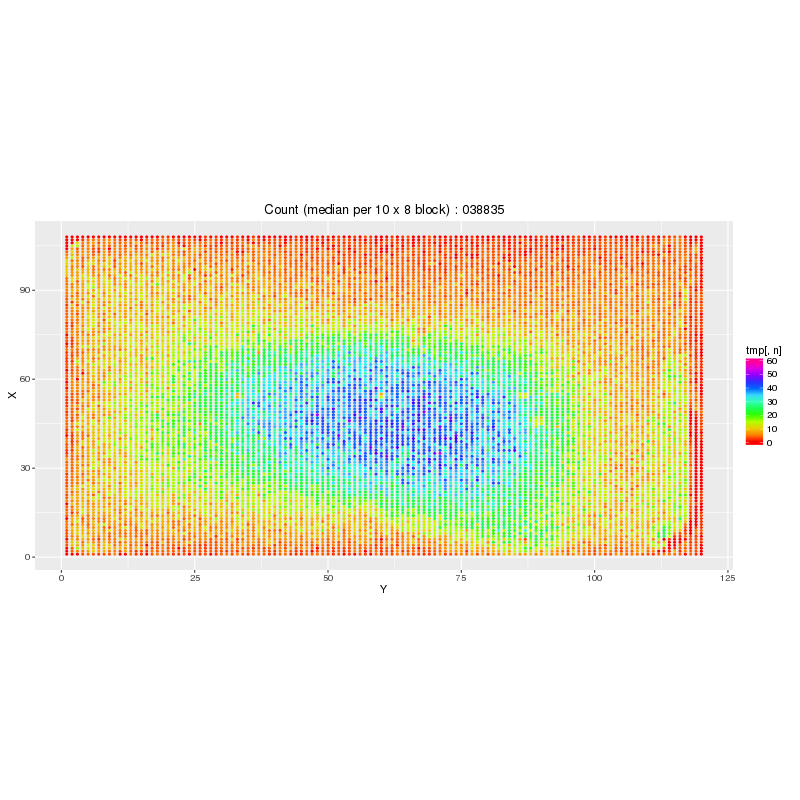
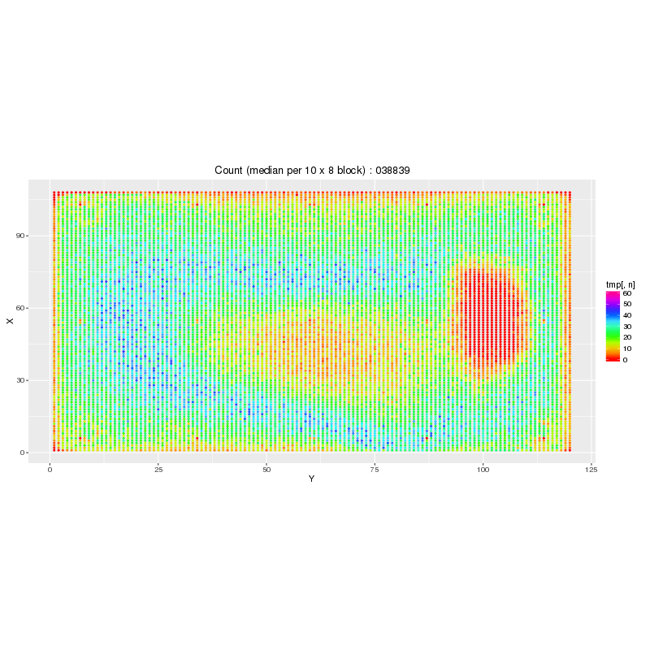

Per-ZMW Stats
#############

History
=======

In the RS, a stats file containing metrics for each ZMW was generated in CSV format.

The ``.sts.h5`` file format
===========================

In Sequel, the stats file is stored in HDF5 format. The format of the ``.sts.h5`` file is `documented here
<http://sharepoint/progmgmt/Sequel/ResearchAndDevelopment/Software/Primary/FunctionalSpecifications/SequelPrimaryAnalysisMetrics.docx>`_
in section 4.2 ("``.sts.h5``").

In summary, the file is an HDF5 format. It contains several multidimensional datasets, where each dataset is first dimensioned by
the ZMW index (0..1.1 million), then optionally dimensioned by other aspects such as Analog (nA), Filter Channel (nC) or time slice (nT).
Thus the ``.sts.h5`` file gives detailed information about each ZMW, and a typical file may be several Gigabytes.

The ``.rsts.h5`` file format
============================

First draft of this document is found `here on OneNote
<onenote:http://sharepoint/progmgmt/Sequel/OneNote/Sequel/System/System%20Metrics.one#Draft%20FS%20SEQ-749&section-id={E738E6A2-C1FA-40A0-B5D0-612540143686}&page-id={D16BF7C2-1973-4602-AEE2-025FAEF2FED4}&end)>`_

The ``.sts.h5`` file is moderately large (5 GB is typical), so a reduced file (with a "``.rsts.h5``" suffix) is produced in the production flow
to be easily transferfed off instrument for support and diagnostic purposes (cell and system performance).  The files can be transferred back to PacBio
headquarters using Axeda.

Here is an example heat-map (this one is generated from BAM output, not the ``.rsts.h5``, but the principle is the same)
that can be created to allow the R&D team to analyze the experiments and potentially identify root cause failures.

   Example of a heat map showing the number of ZMWs that have a High Quality Region (HQR) in each aggregation 10x8 bin.

By aggregating with a hypothetical bin size of 8x8, each simple heat map will contain only 16.2K pixels (120x135).
This would translate into

   +----------------+----------+--------------------------------------------+
   | Data size      | set size | Example                                    |
   +----------------+----------+--------------------------------------------+
   | 8 bit integer  | 16.2 KB  | HQR Count                                  |
   +----------------+----------+--------------------------------------------+
   | 16 bit integer | 32.4 KB  | HQRegionStartTime (truncated to integer)   |
   +----------------+----------+--------------------------------------------+
   | 32 bit float   | 64.8 KB  | ReadLength, and most other metrics         |
   +----------------+----------+--------------------------------------------+

per image. With an upper limit of 10MB, this translates into at least 150 datasets.

All spatial coordinates are in Unit Cell coordinates, that is, each ZMW is 1x1 in size. *Do not confuse this with pixel
coordinates.*  The first normal ZMW is at UnitCell(X,y,) = (64,64).

The format of the file will be as follows:

* The top HDF5 Group will be ``/ReducedZMWMetrics`` to avoid confusion with the ``/ZMWMetrics`` source group.
* Each algorithm will have two levels of subgroups. This is to avoid name space collisions
  if the same input dataset is aggregated using two different algorithms (``Min``, ``Max`` and ``Mean`` for example)
  or filters. The format will be ``/ReducedZMWMetrics/$filter/$algorithm/$metric``.
  For example, ``/ReducedMetrics/P1/Mean/NumBases``.
* The source dataset names from the ``.sts.h5`` will be otherwise preserved.
* The dimensions of the datasets will be modified as follows

   * nH (ZMW dimension) will be replaced by nRROW x nRCOL dimensions, where nRROW is the number of reduced rows and nRCOL is the number of reduced columns
   * nA (Number Analogs) will remain the same
   * nC (Number of Channels) will remain the same
   * nT (Number of time slices) will be replaced by nRT, the number of reduced time slices
   * The order of dimensions will remain the same.  For example, a ``.sts.h5`` dataset of size "NH x nC" will be reduced to a
     rstst.h5 data set of size "NRROW x nRCOL x NC".

* The existing dataset attributes will be copied over from the ``.sts.h5`` file.

   * ``Description``
   * ``HQRegion``
   * ``UnitsOrEncoding``
   * ``BinSize``

* New attributes will be added

   * ``BinRows`` (uint32) - the number of rows aggregated into the reduced row. For example, 8 rows from the ``.sts.h5`` file are reduced
     to one row in the ``.rsts.h5`` file. A typical value will be 8.
   * ``BinCols`` (uint32) - the number of columns aggregated in to the reduced column. For example, 10 columns from the ``.sts.h5`` file
     are reduced to one column in the ``.rsts.h5`` file.  A typical value will be 8.
   * ``UnitCellOffsetX`` (uint32) - the Unit Cell X coordinate of the first Unit Cell of the first bin stored in the ``.rsts.h5`` file.
   * ``UnitCellOffsetY`` (uint32) - the Unit Cell Y coordinate of the first Unit Cell of the first bin stored in the ``.rsts.h5`` file.
   * ``Algorithm`` (string) - the method used to aggregate the data in the bin. Possible values are

     * ``"Count=N"`` - count the values that match the enumeration value. The numeration value N can be any integer value.
       For example, ``"Count=1"`` for ``Productivity`` will match enumeration value 1 : "Productive HQ-Region".
     * ``"Sum"`` - the aggregate value is the sum of values.
     * ``"Subsample"`` - the aggregate  value is simply the value of the first ZMW in the bin
     * ``"Mean"`` - the aggregate value is the mean in the bin.
     * ``"Median"`` - the aggregate value is the median of values.
     * Other future algorithms that may be supported are ``Min``, ``Max``, ``Stddev``,
       ``MAD`` (`Median Absolute Deviation <https://en.wikipedia.org/wiki/Median_absolute_deviation>`_)

   * ``Filter`` (string) - the filter used to select ZMWs within the bin

     * ``"All"`` - all ZMWS are used (for example, if the bin size is 8x10, then 80 ZMWS are selected). This will include
       nonsequencing ZMWS, such as fiducials and anti-ZMWs.
     * ``"Sequencing"`` - only normal ZMWS that are identified as "sequencing" (i.e. not fiducials, anti-ZMWS, etc) are
       including in the aggregation.
     * ``"NonSequencing"`` - only ZMWs that are not identified as normal "sequencing" ZMWS,
       i.e. fiducials, anti-ZMWS, etc. Base calling is performed on all
       ZMWS, regardless of type, so selecting ZMWS that are not expected to produce base calls can be a useful
       sanity check by verifying there is no significant activity.
     * ``"Fiducial"`` - only ZMWs with the Fiducial bit set
     * ``"Power"`` - only ZMWS with the Power bit set
     * ``"InactiveArea"`` - only ZMWs with the InactiveArea bit set
     * ``"P0"`` - only ZMWs with a productivity rating of P0
     * ``"P1"`` - only ZMWs with a productivity rating of P1 (aka High Quality Regions (HQR)) are used in the aggregate.
     * ``"P2"`` - only ZMWs with a productivity rating of P2

     ``Filter`` does not apply to the ``"Subsample"`` aggregation, which will always take the first ZMW in the bin.

The ``ppa-reducestats`` executable
==================================

An self-standing executable converts the ``.sts.h5`` file to ``.rsts.h5``. It will have the following arguments

  * input: Input ``.sts.h5`` file path
  * output: Output ``.rsts.h5`` file path
  * config: The configuration expression (immediate JSON, or JSON file path)
  * TBD: options to integrate progress monitoring by ppad if necessary

The configuration file that creates the ``.rsts.h5`` file will include the following information:

  * ``BinRows`` - The row dimension (X) of the rectangular bin used to aggregate the data. Default 8.
  * ``BinCols`` - the column dimension (Y) of the rectangular bin used to aggregate the data. Default 8
  * ``UnitCellOffsetX`` - The X index of the first ZMW of the first bin. This will typically by 0x40, which represents the
    first usable (sequencing) ZMW of the Sequel chip.
  * ``UnitCellOffsetY`` - The Y index of the first ZMW of the first bin. This will typically by 0x40, which represents the
    first usable (sequencing) ZMW of the Sequel chip.
  * ``UnitCellRows`` - The count of UnitCells that should be binned in the X dimension. Default: 1080
  * ``UnitCellCols`` - The count of UnitCells that should be binner in the Y dimension. Default: 960
  * ``Outputs`` - A list of reduction specifications:
     * ``Input``: HDF5 datasets name with full HDF5 path. Example: "/ZmwMetrics/BaseRate"
     * ``Algorithm``: Algorithm name used to aggregate. See the rsts.h5 file specification for allowed values.
     * ``Filter``: Filter names used to aggregate. See the rsts.h5 file specification for allowed values.
     * ``Type``: Output type. The default will be "float" and this should be appropriate in all cases. Internally, double
       precision will be used, which can acccurately represent all values (except ``uint64``). Converting to
       integer values will be saturating. For example, converting to ``uint8`` will clamp the values to
       [0,255]. It will be up to the end-user to chose the appropriate type that won't saturate but will
       minimize disk space. Allowed values

       * ``"float"``  : 32 bit floating point
       * ``"double"`` : 64 bit floating point
       * ``"uint8"``  : 8 bit unsigned integer
       * ``"int8"``   : 8 bit unsigned integer
       * ``"uint16"`` : 16 bit unsigned integer
       * ``"int16"``  : 16 bit unsigned integer
       * ``"uint32"`` : 32 bit unsigned integer
       * ``"int32"``  : 32 bit unsigned integer

     * Per metrics overrides for ``BinRows``, ``BinCols``, ``UnitCelloffsetX`` and ``UnitCelloffsetY``

The configuration file will be specified in JSON format. There will be a default JSON configuration file that will be
embedded in the ppa-statreduce.  An example JSON specification is given below.

Use case 1
==========

Loading performance and segmenting between surface/Workflow and illumination issues

We generate 4 metrics currently that are useful to help troubleshoot poor loading cells.

	1. 120x108 Array/List of bytes to generate Heatmap of # of ZMWs with HQ regions in 8x10 blocks.
	2. 120x108 Array/List of floats to generate Heatmap of Median pkmid
	3. 120x108 Array/List of floats to generate Heatmap of Median SNR C
	4. Float: SEQ-755: Generate Loading Uniformity Metric (LUM)

We will focus on the Heatmaps:

In order to reduce the data, internally we bin it in 8x10 blocks. This allows us to have a view of similar Waveguides. This leaves us with::

    960/8=120 columns
    1080/10=108 rows
    Or 120*108=12,960  data points

The goal is to generate an array or list of bytes that we could data mine and/or produce images further down the troubleshooting process.
If we use a single byte to encode the value of 0-80 for the number of ZMWs with an HQ region we could recreate the first graph

Here are a few examples:

   An example of a cell that failed to load in a specific area

Default reductions
==================

A JSON configuration object drives how the ``ppa-reducestats`` program treats the sts.h5 file and creates the rsts.h5.
The default JSON configuration object is

.. include:: ../../common/pacbio/primary/ZmwReducedStatsFile.h
   :start-after: json(
   :end-before: )json
   :code: json

This will result in the following HDF5 datasets with the corresponding numerical format and array dimensions::

   /ReducedMetrics/All/Sum/NumBases                  float[nRROW][nRCOL]
   /ReducedMetrics/Sequencing/Count=0/Productivity   uint8[nRROW][nRCOL]
   /ReducedMetrics/Sequencing/Count=1/Productivity   uint8[nRROW][nRCOL]
   /ReducedMetrics/Sequencing/Count=2/Productivity   uint8[nRROW][nRCOL]
   /ReducedMetrics/Sequencing/Mean/BaselineLevel     float[nRROW][nRCOL][nC]
   /ReducedMetrics/Sequencing/Median/BaselineLevel   float[nRROW][nRCOL][nC]
   /ReducedMetrics/P1/Mean/BaseIpd                   float[nRROW][nRCOL]
   /ReducedMetrics/P1/Mean/BaselineLevel             float[nRROW][nRCOL][nC]
   /ReducedMetrics/P1/Mean/BaseWidth                 float[nRROW][nRCOL]
   /ReducedMetrics/P1/Median/HQPkmid                 float[nRROW][nRCOL][nA]
   /ReducedMetrics/P1/Median/HQRegionSnrMean         float[nRROW][nRCOL][nA]
   /ReducedMetrics/P1/Median/HQRegionStart           float[nRROW][nRCOL]
   /ReducedMetrics/P1/Median/HQRegionStartTime       uint16[nRROW][nRCOL]
   /ReducedMetrics/P1/Median/ReadLength              float[nRROW][nRCOL]
   /ReducedMetrics/P1/Median/SnrMean                 float[nRROW][nRCOL][nA]

   nRROW =  135 = ((1144-64)/8)
   nRCOL =  120 = ((1024-64)/8)
   nC    =    2 = (Green, Red).count
   nA    =    4 = (A,C,G,T).count

To use a different config file, create a new file, seeded with the above JSON snippet object or
the result of ``ppa-reducestats --showconfig`` (which will show both pre and post processed JSON objects).
The JSON format is documented elsewhere.  White space is liberal, but matching braces, commas and correct quoting
of field names is important.

Example usage with custom config file::

   module load ppa/mainlina
   ppa-reducestats --input /tmp/m12345.sts.h5 --output /tmp/m12345.rsts.h5 --config myreduction.json

Reductions Work Flow
====================

1. ``ppad`` runs ``baz2bam`` which generates the ``.sts.h5`` file after processing the BAZ file.
2. ``ppad`` will then run ``ppa-reducestats`` on the ``.sts.h5`` file and produce a ``.rsts.h5`` file.
3. ``ppad`` will then run ``scp`` and copy the file to pbi@icc. To find the path, run ``ppad--help``
4. ``ppad`` will then delete the rsts.h5 file. Note that if the copy fails, the file is deleted anyways.

